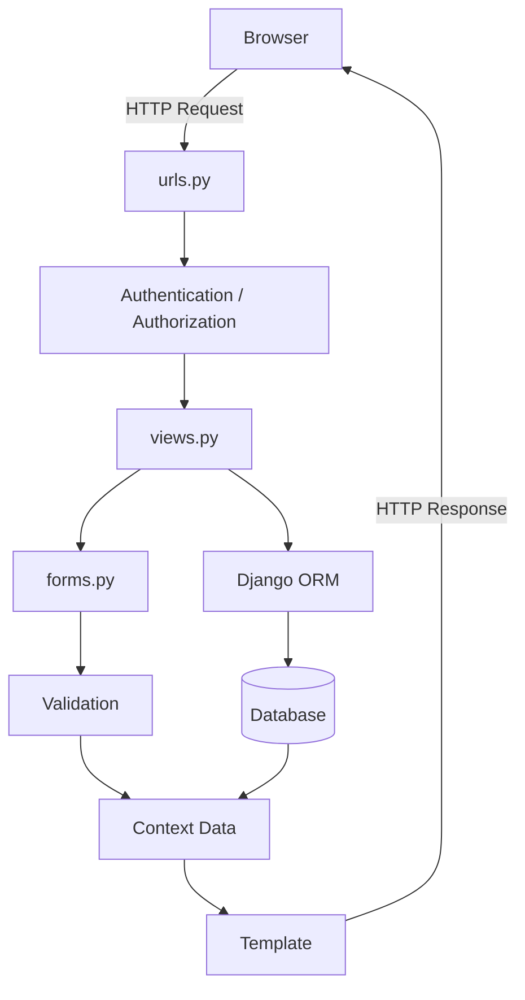
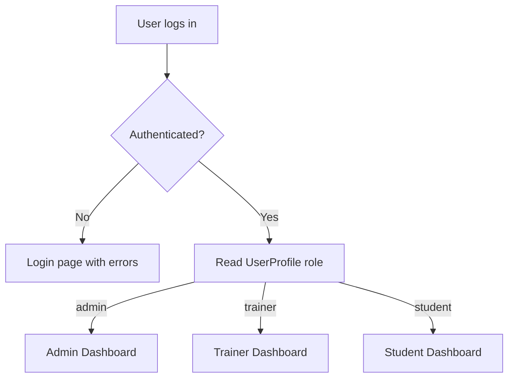
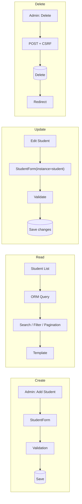
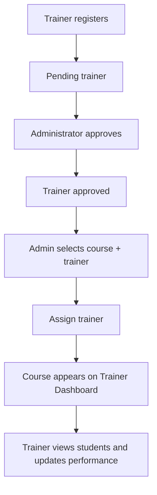
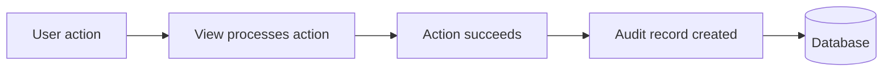
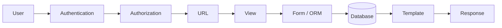

<div align="center">

# 🎓 Training Management Portal

**A role-based Django web application for managing students, trainers, courses, performance and audit activity.**


**Roles:** Administrator · Trainer · Student

</div>

---

## Table of Contents

- [Project Overview](#project-overview)
- [Key Features](#key-features)
- [Day 5 – Release Polish](#day-5--release-polish)
- [Technology Stack](#technology-stack)
- [Application Roles](#application-roles)
- [Role and Permission Matrix](#role-and-permission-matrix)
- [Project Structure](#project-structure)
- [Application Workflow](#application-workflow)
- [Authentication and Authorization](#authentication-and-authorization)
- [Feature Workflows](#feature-workflows)
- [Security](#security)
- [Database and ORM](#database-and-orm)
- [Templates and UI](#templates-and-ui)
- [Installation and Setup](#installation-and-setup)
- [Demo Data and Credentials](#demo-data-and-credentials)
- [Running the Project](#running-the-project)
- [Testing](#testing)
- [Production Deployment](#production-deployment)
- [Release Checklist](#release-checklist)
- [Common Django Commands](#common-django-commands)
- [Future Improvements](#future-improvements)
- [Conclusion](#conclusion)

---

## Project Overview

The **Training Management Portal** manages a training institute's day-to-day operations through one centralized web application. It follows Django's **Model-Template-View (MVT)** architecture.

| Item | Details |
|---|---|
| **Project type** | Django web application |
| **Architecture** | Model-Template-View (MVT) |
| **Database** | SQLite (development) |
| **UI** | Bootstrap, static CSS, JavaScript |
| **Purpose** | Student, trainer, course and account management |
| **Repository** | [internship-task-submissions / training_project](https://github.com/BurnettBrucke/internship-task-submissions/tree/adityasingh/training_project) |

The system supports:

- Role-based authentication and authorization
- Student CRUD operations
- Trainer registration and approval
- Course management and trainer–course assignment
- Student marks, marks history, feedback and pass/fail results
- Account activation / deactivation
- Password change and password reset
- Search, filters and pagination
- Audit logs
- Separate dashboards for each role
- Responsive Bootstrap-based UI
- Custom 403, 404 and 500 error pages

---

## Key Features

### 1. Role-Based Authentication
- Three roles: **Administrator**, **Trainer**, **Student**
- After login, users are redirected to the dashboard for their role

### 2. Role-Based Authorization
- Access to views is controlled by the user's role
- Administrators manage students and trainers
- Trainers access their assigned courses and students
- Students access only their own information and performance

### 3. Student Management
Administrators can:
- Add, view, search, edit and delete students
- View student details
- View marks and pass/fail status
- Manage student active status

### 4. Trainer Management
- Trainer registration
- Trainer approval by an administrator
- Trainer activation / deactivation
- Trainer-specific dashboard
- Assigned course and student visibility

### 5. Course Management
- Course information
- Trainer assignment
- Student enrollment / association
- Course visibility on trainer dashboards

### 6. Account Management
- Users can change their password, request a password reset, reset via emailed link and view account information
- Administrators can activate and deactivate accounts

### 7. Student Performance
- Marks and marks history
- Pass/fail result
- Trainer feedback
- Performance progress

### 8. Audit Logging
Important actions are recorded with:
- User
- Action
- Date / time
- IP address

### 9. Search, Filters and Pagination
- Search students by name / email
- Filter student records
- Paginated listings

### 10. Reusable Templates
Shared components: navbar, messages, pagination, form errors, breadcrumbs.

---

## Day 5 – Release Polish

Day 5 focused on finishing all incomplete functionality and bringing the portal to a **demonstrable release state**.

### Functional completion
- [x] Reviewed Day 1–4 requirements and closed incomplete items
- [x] Verified CRUD, authentication, roles, feedback, marks history, audit logs, search, filters and pagination
- [x] Added custom **403**, **404** and **500** error pages
- [x] Added consistent navigation, **breadcrumbs** and **page titles**
- [x] All forms display clear validation errors
- [x] Removed debug `print` statements and unused code

### Template and frontend completion
- [x] One `base.html` used across the whole project
- [x] Consistent spacing, cards, tables, badges and buttons
- [x] Responsive on desktop, tablet and mobile widths
- [x] Loading / disabled submit buttons to prevent double submission
- [x] Empty states for lists with no records
- [x] Project-specific styling moved to static CSS instead of inline styles

### Data and demo preparation
- [x] Realistic seed data for administrators, trainers, students, departments and courses
- [x] At least **20 students** and **5 courses**
- [x] Marks, feedback and audit events included
- [x] Demo credentials for each role (no real secrets)
- [x] Management command `seed_demo_data` for loading sample data

### Release configuration
- [x] Separate production settings example with `DEBUG = False`
- [x] `SECRET_KEY` and database settings read from environment variables
- [x] `ALLOWED_HOSTS` configured
- [x] Static files collected with `collectstatic`
- [x] Migrations run from a clean database
- [x] Full test suite run
- [x] Setup and deployment commands documented (this README)

---

## Technology Stack

| Technology | Purpose |
|---|---|
| Python | Programming language |
| Django 6.1.1 | Web framework |
| SQLite | Development database |
| Django ORM | Database interaction |
| HTML5 | Page structure |
| CSS (static files) | Project styling |
| Bootstrap | Responsive UI |
| JavaScript | Client-side interactions |
| Git / GitHub | Version control |

---

## Application Roles

### 👨‍💼 Administrator
System-level management:
- Manage students and trainers
- Approve trainers
- Manage courses and assign trainers
- Activate / deactivate accounts
- View system statistics
- View audit logs

### 👨‍🏫 Trainer
Works with assigned courses and students:
- View assigned courses
- View students in assigned courses
- Update student marks, feedback and performance
- Access the trainer dashboard

### 👨‍🎓 Student
Access to personal information only:
- View dashboard and profile
- View marks / performance and marks history
- View result and trainer feedback

---

## Role and Permission Matrix

| Feature / Action | Administrator | Trainer | Student |
|---|:---:|:---:|:---:|
| Login / Logout | ✅ | ✅ | ✅ |
| View own dashboard | ✅ | ✅ | ✅ |
| View account information | ✅ | ✅ | ✅ |
| Change own password | ✅ | ✅ | ✅ |
| Request / complete password reset | ✅ | ✅ | ✅ |
| View student list | ✅ | ✅ | ❌ |
| Search / filter students | ✅ | ✅ | ❌ |
| Add student | ✅ | ❌ | ❌ |
| View student details | ✅ | ✅ | ❌ |
| Edit student | ✅ | ✅* | ❌ |
| Delete student | ✅ | ❌ | ❌ |
| View student marks | ✅ | ✅ | Own only |
| Update student performance / feedback | ✅ | ✅ | ❌ |
| View admin dashboard | ✅ | ❌ | ❌ |
| View trainer dashboard | ❌ | ✅ | ❌ |
| View student dashboard | ❌ | ❌ | ✅ |
| View trainer list | ✅ | ❌ | ❌ |
| Approve trainer | ✅ | ❌ | ❌ |
| Activate / deactivate user account | ✅ | ❌ | ❌ |
| Assign trainer to course | ✅ | ❌ | ❌ |
| View assigned courses | All relevant courses | Own assigned courses | Relevant enrollment |
| View assigned students | All relevant students | Own assigned students | ❌ |
| View audit logs | ✅ | ❌ | ❌ |

### Permission Notes

- `*` Trainer editing is limited to trainer-managed student information such as marks and feedback.
- Students are restricted to their own data through ownership-based checks.
- **Authentication** (who are you?) and **authorization** (what may you do?) are separate steps.
- **Backend authorization is the real security boundary** — hiding a link in the UI is not enough.

---

## Project Structure

<!-- Adjust file names below to match your actual repository. -->

```text
training_project/
│
├── manage.py
├── requirements.txt
├── .env.example                      # sample environment variables (no real secrets)
├── db.sqlite3                        # development database (do not commit for production)
│
├── training_project/                 # project configuration
│   ├── settings.py                   # development settings
│   ├── settings_production.py        # production settings example (DEBUG=False, env vars)
│   ├── urls.py
│   ├── asgi.py
│   └── wsgi.py
│
├── student/                          # main application
│   ├── migrations/
│   ├── management/
│   │   └── commands/
│   │       └── seed_demo_data.py     # loads demo data
│   ├── models.py
│   ├── views.py
│   ├── forms.py
│   ├── decorators.py                 # role-based access decorators
│   ├── validators.py                 # custom strong-password validator
│   └── tests/ (or tests.py)
│
├── static/
│   └── css/
│       └── styles.css                # project-specific styling
│
└── templates/
    ├── base.html                     # single base template for all pages
    ├── 403.html
    ├── 404.html
    ├── 500.html
    ├── audit_logs.html
    │
    ├── includes/
    │   ├── navbar.html
    │   ├── messages.html
    │   ├── pagination.html
    │   ├── breadcrumbs.html
    │   └── form_errors.html
    │
    ├── dashboards/
    │   ├── admin_dashboard.html
    │   ├── trainer_dashboard.html
    │   └── student_dashboard.html
    │
    ├── registration/
    │   ├── login.html
    │   ├── register.html
    │   ├── password_change.html
    │   ├── password_change_done.html
    │   ├── password_reset_form.html
    │   ├── password_reset_done.html
    │   ├── password_reset_confirm.html
    │   └── password_reset_complete.html
    │
    └── students/
        ├── student_list.html
        ├── student_detail.html
        └── student_form.html
```

---

## Application Workflow

General request–response flow:



Django middleware wraps this cycle and provides sessions, authentication, CSRF protection, messages and security processing.

---

## Authentication and Authorization

- **Authentication** — *"Who is the user?"* Django's auth system handles login, logout, password management and sessions.
- **Authorization** — *"What is this user allowed to do?"* Role-based checks restrict access to views.



Unauthorized access to a protected page returns the custom **403** page.

---

## Feature Workflows

### Student CRUD



### Trainer Approval and Course Assignment



### Account Management

- **Change password:** Authenticated user → validate current/new password → update → success page
- **Password reset:** Forgot password → enter email → reset link → token validation → set new password
- **Activate account:** Administrator → select account → `User.is_active = True`
- **Deactivate account:** Administrator → select account → `User.is_active = False`

### Audit Logging



Each audit record stores **user**, **action**, **created at** and **IP address**. Only administrators can view the audit log page.

---

## Security

- **Authentication** — Django authentication identifies users.
- **Password hashing** — passwords go through Django's password system; no plain text storage.
- **Password validation** — Django's built-in validators plus a custom strong-password validator.
- **CSRF protection** — all POST forms include ``.
- **Session management** — Django sessions maintain login state.
- **Role-based authorization** — backend checks block unauthorized roles.
- **Ownership-based access** — users can only reach resources that belong to them.
- **Account activation** — `is_active = False` prevents login.
- **Double-submit protection** — submit buttons are disabled after the first click.
- **Secrets** — `SECRET_KEY` and database credentials come from environment variables in production.

> ⚠️ **Never commit real secrets** (`SECRET_KEY`, database passwords, email credentials) to `README.md` or GitHub. Keep them in environment variables or an untracked `.env` file.

---

## Database and ORM

Django QuerySets are used instead of raw SQL for normal operations.

```python
Student.objects.all()
Student.objects.filter(active=True)
Student.objects.count()
```

```text
Python code → Django ORM → SQL query → SQLite database
```

### Model Relationships

| Type | Used for |
|---|---|
| **One-to-One** | Django `User` ↔ `UserProfile` |
| **ForeignKey** | Many students belonging to one department |
| **Many-to-Many** | `Course` ↔ `Student` associations |

---

## Templates and UI

The project uses **template inheritance** with a single base template:

```text
base.html
 ├── includes/navbar.html
 ├── includes/messages.html
 ├── includes/breadcrumbs.html
 └── page-specific content
```

- One `base.html` for every page
- Reusable includes: navbar, messages, pagination, breadcrumbs, form errors
- Bootstrap for layout, forms, tables, alerts, cards, badges, navigation and modals
- Project styles live in `static/css/` rather than inline CSS
- Empty states for lists with no records
- Responsive across desktop, tablet and mobile

---

## Installation and Setup

### 1. Clone the project

```bash
git clone https://github.com/BurnettBrucke/internship-task-submissions.git
cd internship-task-submissions
git checkout adityasingh
cd training_project
```

### 2. Create and activate a virtual environment

**Windows**

```bash
python -m venv venv
venv\Scripts\activate
```

**macOS / Linux**

```bash
python3 -m venv venv
source venv/bin/activate
```

### 3. Install dependencies

```bash
pip install -r requirements.txt
```

If there is no `requirements.txt`:

```bash
pip install django
```

### 4. Apply migrations

```bash
python manage.py migrate
```

> Use `python manage.py makemigrations` first only if you have changed the models.

### 5. Load demo data

```bash
python manage.py seed_demo_data
```

### 6. (Optional) Create a superuser

```bash
python manage.py createsuperuser
```

---

## Demo Data and Credentials

The `seed_demo_data` management command creates realistic sample data:

| Data | Amount |
|---|---|
| Administrators | At least 1 |
| Trainers | Several (approved) |
| Students | **20+** |
| Departments | Several |
| Courses | **5+** |
| Marks and feedback | Included for students |
| Audit events | Included |

### Demo accounts

<!-- Replace the placeholders below with the usernames/passwords defined in seed_demo_data.py -->

| Role | Username | Password |
|---|---|---|
| Administrator | `<admin-username>` | `<demo-password>` |
| Trainer | `<trainer-username>` | `<demo-password>` |
| Student | `<student-username>` | `<demo-password>` |

> ⚠️ These are **local demo accounts only**. Never use them (or any password from this README) in production, and never put real secrets in this file.

---

## Running the Project

```bash
python manage.py runserver
```

Open: <http://127.0.0.1:8000/>

### Useful URLs

| URL | Description |
|---|---|
| `/login/` | Login |
| `/register/` | Registration |
| `/dashboard/admin/` | Administrator dashboard |
| `/dashboard/trainer/` | Trainer dashboard |
| `/dashboard/student/` | Student dashboard |
| `/students/` | Student list (search, filters, pagination) |
| `/students/add/` | Add a student |
| `/courses/<id>/assign-trainer/` | Assign a trainer to a course |
| `/account-information/` | Account information |
| `/password-change/` | Change password |
| `/password-reset/` | Request password reset |
| `/admin/trainers/` | Trainer approval list |
| `/admin/audit-logs/` | Audit logs |

### Development notes

- Development uses **SQLite** and Django's **console email backend** — password-reset emails appear in the terminal instead of being sent.

---

## Testing

Run the full test suite:

```bash
python manage.py test
```

Check project configuration:

```bash
python manage.py check
```

---

## Production Deployment

Production settings live in a separate file (`training_project/settings_production.py`) so that `DEBUG` is always `False` and secrets never live in source control.

### Environment variables

<!-- Adjust variable names to match settings_production.py -->

| Variable | Purpose | Example |
|---|---|---|
| `DJANGO_SECRET_KEY` | Django secret key | *(generate a long random value)* |
| `DJANGO_DEBUG` | Debug mode (must be `False`) | `False` |
| `DJANGO_ALLOWED_HOSTS` | Comma-separated allowed hosts | `example.com,www.example.com` |
| `DB_NAME` | Database name | `training_db` |
| `DB_USER` | Database user | `training_user` |
| `DB_PASSWORD` | Database password | *(keep private)* |
| `DB_HOST` | Database host | `localhost` |
| `DB_PORT` | Database port | `5432` |

Provide a template file named `.env.example` (safe to commit) and keep the real `.env` out of Git via `.gitignore`.

### Deployment commands

**Windows (PowerShell)**

```powershell
$env:DJANGO_SETTINGS_MODULE = "training_project.settings_production"
$env:DJANGO_SECRET_KEY = "<your-secret-key>"
$env:DJANGO_ALLOWED_HOSTS = "example.com"
```

**macOS / Linux**

```bash
export DJANGO_SETTINGS_MODULE=training_project.settings_production
export DJANGO_SECRET_KEY="<your-secret-key>"
export DJANGO_ALLOWED_HOSTS="example.com"
```

Then:

```bash
python manage.py check --deploy       # production security checks
python manage.py migrate              # apply migrations
python manage.py collectstatic --noinput
python manage.py test                 # optional final verification
```

### Production hardening

- Set `DEBUG = False`
- Load `SECRET_KEY` from an environment variable
- Configure `ALLOWED_HOSTS`
- Use a production-ready database such as PostgreSQL
- Configure a real email backend
- Enable secure cookies and HTTPS
- Serve static/media files correctly (`STATIC_ROOT`, web server or WhiteNoise)
- Do **not** run `seed_demo_data` with demo passwords on a real deployment

---

## Release Checklist

- [x] All Day 1–4 requirements reviewed and completed
- [x] CRUD, authentication, roles, feedback, marks history, audit logs, search, filters and pagination verified
- [x] Custom 403, 404 and 500 pages
- [x] Breadcrumbs, consistent navigation and page titles
- [x] Clear validation errors on all forms
- [x] Debug prints and unused code removed
- [x] Single base template
- [x] Consistent cards, tables, badges and buttons
- [x] Responsive layout (desktop / tablet / mobile)
- [x] Disabled/loading state on submit buttons
- [x] Empty states for empty lists
- [x] Static CSS instead of heavy inline CSS
- [x] Seed data: 20+ students, 5+ courses, marks, feedback, audit events
- [x] Demo credentials per role (no real secrets)
- [x] `seed_demo_data` management command
- [x] Production settings example with `DEBUG = False`
- [x] Environment variables for `SECRET_KEY` and database settings
- [x] `ALLOWED_HOSTS` configured
- [x] `collectstatic` run
- [x] Migrations run from a clean database
- [x] Full test suite passing
- [x] Setup and deployment documented

<!-- Tick or untick items above so they match what you have actually completed. -->

### Clean-database verification

```bash
# Windows: del db.sqlite3      macOS/Linux: rm db.sqlite3
python manage.py migrate
python manage.py seed_demo_data
python manage.py test
```

---

## Common Django Commands

| Task | Command |
|---|---|
| Start server | `python manage.py runserver` |
| Check configuration | `python manage.py check` |
| Production checks | `python manage.py check --deploy` |
| Create migrations | `python manage.py makemigrations` |
| Apply migrations | `python manage.py migrate` |
| Create superuser | `python manage.py createsuperuser` |
| Load demo data | `python manage.py seed_demo_data` |
| Collect static files | `python manage.py collectstatic` |
| Run tests | `python manage.py test` |
| Open Django shell | `python manage.py shell` |

---

## Future Improvements

- REST API using Django REST Framework
- Expanded automated unit and integration tests
- Advanced reporting and analytics
- Trainer/student notification system
- Email notifications for trainer approval
- Advanced filtering and sorting
- PostgreSQL in production
- Docker deployment
- CI/CD pipeline
- More granular Django permissions
- Attendance management
- Course completion tracking

---

## Conclusion

The Training Management Portal demonstrates a complete Django web application featuring authentication, authorization, role-based dashboards, CRUD operations, ORM relationships, forms and validation, course and trainer management, student performance and feedback, account management, audit logging, search and pagination, reusable templates, custom error pages and a documented release process.



This structure keeps the application organized and makes each feature easy to maintain and extend.